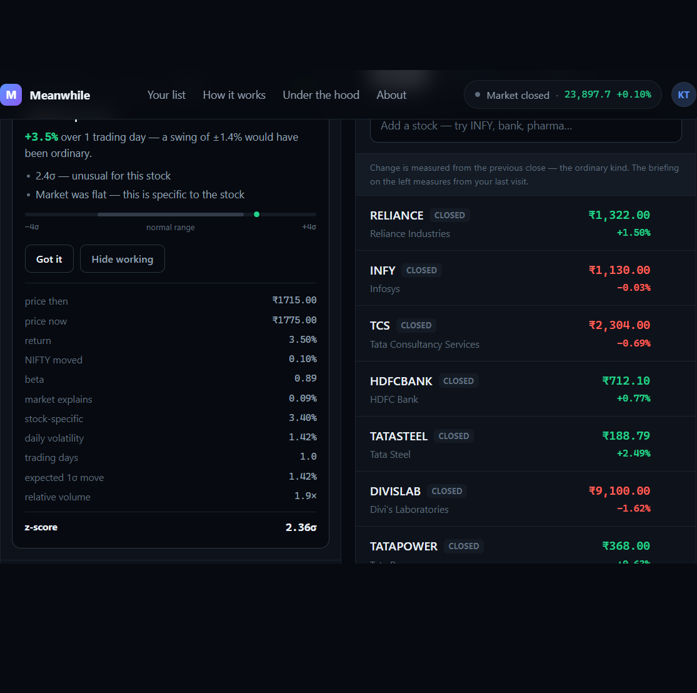
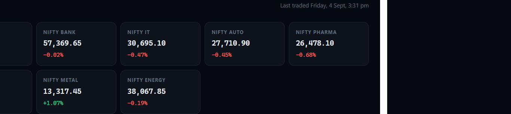
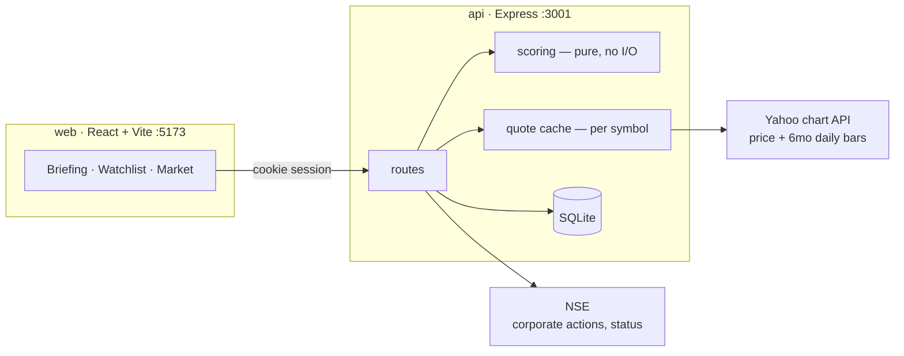
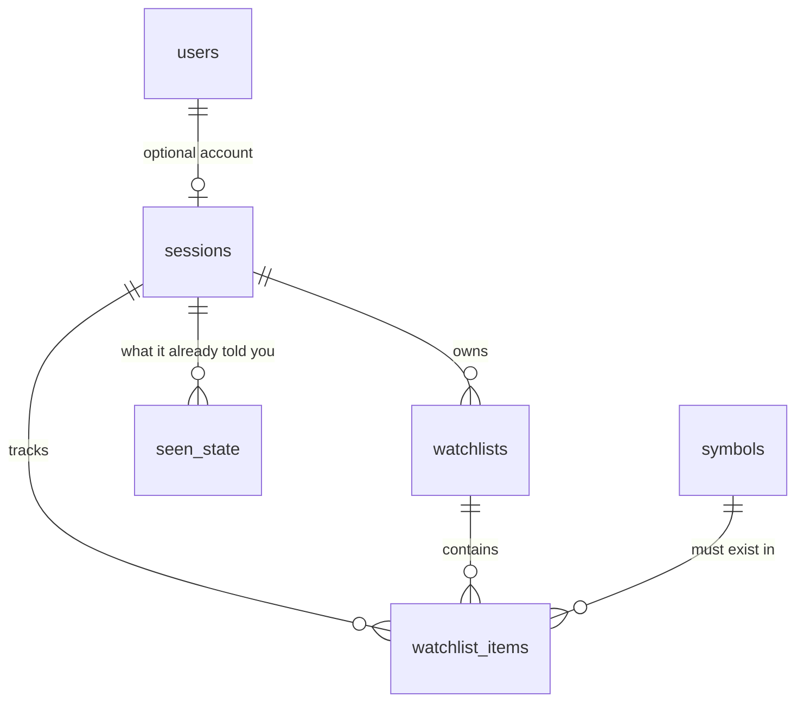

# Meanwhile

**A market watchlist that tells you what happened while you were away — and stays quiet when nothing did.**

Every watchlist measures from yesterday's close, an anchor that resets at 9:15 and that you never chose. Disappear for a week and it reports "+0.3% today" while saying nothing about the 11% fall you slept through.

This one measures from **the moment you last looked**.



---

## Run it

Node 22.6+. Nothing else — no database server, no Docker, no API key, no `.env`.

```bash
git clone https://github.com/thanmai-kolli/smart-market-watchlist.git
cd smart-market-watchlist
npm install
npm run dev
```

Open **http://localhost:5173** — the API starts itself on `:3001`.

The database creates and seeds itself on first run, so the first screen has live NSE data in it immediately. There is no signup: the app works before it asks you for anything.

| | |
|---|---|
| `npm test` | 71 tests |
| `npm run typecheck` | both services |

---

## What it does

**It shows the market**, then it shows only what changed *for you*.



Every price carries its state — `live`, `closed`, `stale` or `halted`. Four of those eight indices quote a level but stopped publishing daily bars, so their day change comes from **NSE itself** rather than being derived from history that no longer arrives.

**Then it ranks.** Three cards at most, or it says nothing needs you and shows the evidence for that claim. Tap **Why?** for every step — price then and now, what the market explains, beta, volatility, elapsed trading days, and the resulting z-score. That is the table in the screenshot above.

---

## How it decides

Six filters between a price change and your attention:

| | filter | why |
|---|---|---|
| 1 | Measure since **your** last visit | a week away should be measured as a week |
| 2 | Divide by that stock's **own volatility** | 3% in a large-cap is remarkable; in a small-cap it's Tuesday |
| 3 | Subtract what the **whole market** did | if everything fell 2%, nothing happened to *your* stock |
| 4 | Confirm with **volume** | the same move on 4× volume means something different |
| 5 | **Never repeat yourself** | crying wolf twice is why people mute notifications |
| 6 | **Three cards, or none** | a fixed budget forces ranking instead of listing |

Which reduces to one number:

```
z = (return − beta × market return) ÷ (volatility × √days)
```

The `√days` term is what lets one formula handle *"I checked ten minutes ago"* and *"I checked three weeks ago"* with no special cases.

---

## Architecture



**The messiness lives at the edges; the judgement lives in the pure middle.** `scoring/` takes plain numbers and returns a decision — no database, no network, no clock — which is why the six market situations it has to get right can be tested in milliseconds.

Prices are cached **per symbol, not per user**, so ten thousand users watching fifty stocks each is still bounded by the ~2,000 symbols NSE has.



`seen_state` stores **a timestamp, never a price** — a split between two visits would silently turn ₹1,500 into an 80% crash that never happened. Acknowledgement is a monotone `MAX()`, so two devices converge instead of overwriting each other.

---

## The six decisions

| decision | answer |
|---|---|
| **What counts as meaningful** | ~2σ, market-adjusted. Threshold **measured over 4,240 symbol-days**, not chosen — real tails are 4.8× fatter than normal at 3σ. |
| **What to surface** | Three cards, ranked. Every clause is one stage of the maths in English; **Why?** opens the arithmetic. |
| **State across sessions and devices** | Anonymous cookie + SQLite, no signup wall. Optional account (scrypt). One-time sync code. Adopt, never merge. |
| **Stale or conflicting data** | Prices carry state. An outage says so rather than reporting calm markets. Benchmark cross-checked against NSE; disagreement shown. |
| **Scale** | Cached per symbol, not per user. **200 users → 9 upstream calls cold, 0 warm.** 300,000 rows → **0.331 ms**. |
| **Where to keep it simple** | Six production dependencies. No queue, Redis, Docker or ORM. |

---

## Verify the claims

These hit the live feed, so today's numbers will differ from the ones quoted above.

| | |
|---|---|
| `npm run check-accuracy -w api` | our prices vs NSE's own published index values — **8 of 8 at 0.0000%** |
| `npm run calibrate -w api` | re-derives the 2σ threshold from a year of history |
| `npm run check-freshness -w api` | every symbol's history reaches its own quote — **143/143** including the benchmark |
| `npm run check-cluster -w api` | sweeps the universe for a real sector cluster |
| `npm run check-coverage -w api` | which symbols would fire a card today |
| `npm run check-scale -w api` | builds 300,000 rows and prints the query plan |
| `npm run check-load -w api` | 200 concurrent visitors, and the upstream calls they cost *(server running)* |
| `npm run check-sync -w api` | cross-device sync with two cookie jars *(server running)* |
| `npm run explain -w api` | the arithmetic behind one symbol |

---

## Not investment advice

Everything here is a factual observation about price movement, never a recommendation. Prices are delayed and always shown with their state.
